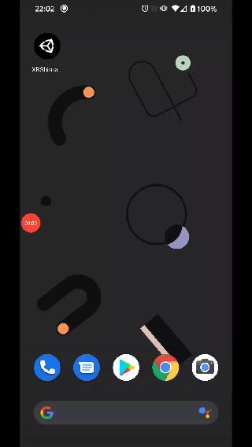
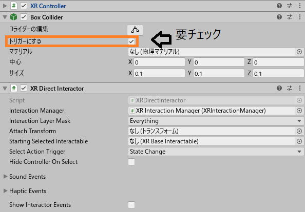
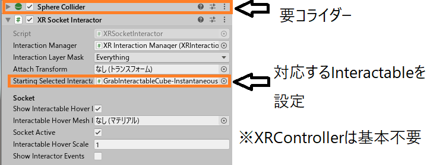
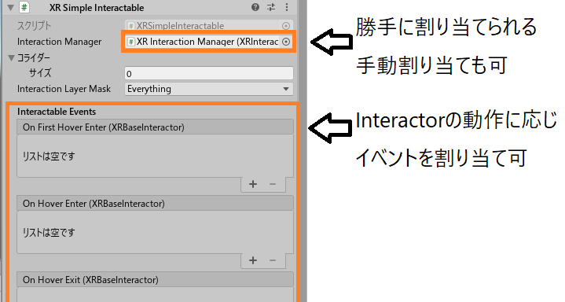
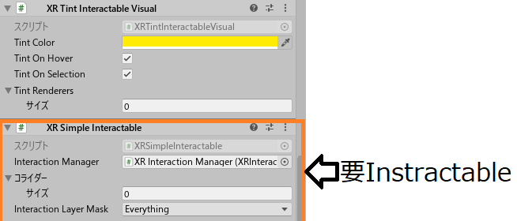
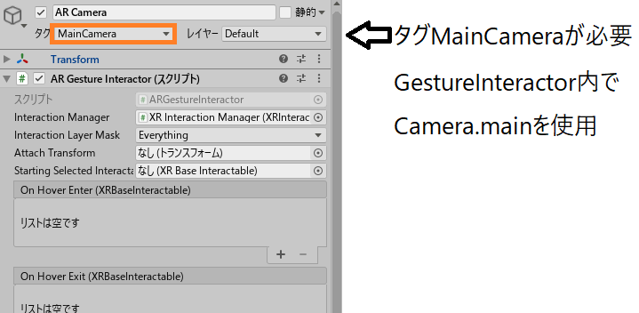
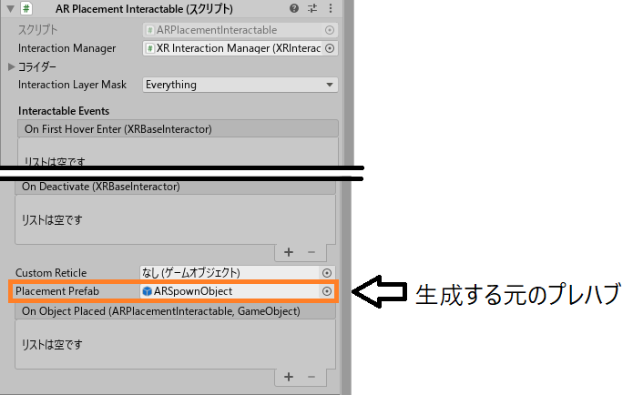

# XR Interaction Toolkit
## を使ってみた話

@yusuke-ota

---

<!--
* AR <= サンプルがほとんど無いので、触ってみて、まとめる

-->

## 自己紹介

@yusuke-ota

**アマチュアプログラマー**  
C++(PlatformIO)、C#(Unity)、Rust、Ruby

**最近気になること**  
Unreal Engine、シェーダー、サーバー

---

## XR開発環境(Unity公式)

[画像引用]  
Unity XR  
プラットフォームの  
最新情報
<https://blogs.unity3d.com/jp/2020/01/24/unity-xr-platform-updates/>

---

### MARS

は分からないので、飛ばします  
(6/1から使えるらしい)

---

### AR Foundationとは

別機種間のAR関係の処理を**同じコード**で書ける  
(機種依存機能は除く)

**Ver3.x**  
AR Core、AR Kit対応

**Ver4.x(preview)**  
AR Core、AR Kit、**HoloLens、Magic Leap One**対応

---

### AR Foundation蛇足

AR FoundationでARアプリを作って  
実機上で起動できない(起動してすぐに落ちる)場合

ARCore XR PluginやARKit XR Pluginが  
**入っていない可能性が高い**

---

ARCoreXRPluginがない時の動作.gif

---

### XR Interaction Toolkitとは

入力周りのあれこれの実装を楽にしてくれる  

**VR**: UI操作、つかむ動作、スナップ機能、歩行  
**AR**: UI操作、オブジェクト操作、オブジェクト生成

---

## XR Interaction Toolkit

### AR、VRでの機能対応表

|機能|AR|VR|
|:---:|:---:|:---:|
|オブジェクトインタラクション|〇|〇|
|UIインタラクション|〇|〇|
|オブジェクト配置|〇|×|
|ロコモーション|×|〇|

---

### 機能分類表

// TODO: 作成

---

## オブジェクトインタラクション

**Interactor**

動作の主体(主にコントローラ)

**Interactable**

動作の客体(主にキューブなどのオブジェクト)

---

## VR

### Interactor

動作の主体(主にコントローラ)

---

#### XRRayInteractor

レイキャストを出す機能、物の指定とか

---

VR上の画像

---

#### XRDirectInteractor

直接オブジェクトを触って操作する機能  
よくわかんなかった

---

VR上の画像

---

#### XRSocketInteractor

対応するオブジェクトを設定した位置に戻す機能  
イメージとしては磁石

---

VR上の画像

---

### Interactable

動作の客体(主にキューブなどのオブジェクト)

---

#### XRSimpleInteractable

カーソルの操作によってイベントを発火させることができる機能

---

VR上の画像

---

#### XRGrabInteractable

XRSimpleInteractable + つかむ機能  
基本的に持ち運び出来るオブジェクトにはこっち
<video height="500"><source src="ImageForDocument/GrabInteractable.mp4"></video>

---

Velocity: 速度を加えて移動させる(ばねっぽい挙動)  
Kinematic: 座標を書き換えて移動させる  
Instantaneous: Physicsがかからない(Dynamic updateっていつ?)

---

#### XRTintInteractableVisual

カーソルホバー、選択時などで、オブジェクトの色を変えて強調する機能  
[Emission](https://docs.unity3d.com/ja/2019.1/Manual/StandardShaderMaterialParameterEmission.html) 対応のシェーダーが必要らしい  
要Interactable

---

動画

---

## AR

### Interactor

動作の主体

---

#### ARGestureInteractor

タップ、スワイプ、ピンチなどで、オブジェクトを操作する機能  
**はまりポイント**: AR CameraにMainCameraタグが必要

<!-- 
GetValidTargets()内でCamera.mainを使用する -> 
MainCameraタグが必要 -> 
しかしAR CameraにはデフォルトでMainCameraタグがついていない
-->

---

AR上の画像

---

### Interactable

動作の客体

---

#### ARPlacementInteractable

平面に設定されているプレハブを生成する

---

AR上の画像

---

#### ARRotationInteractable

// todo:

---

AR上の画像

---

#### ARScaleInteractable

// todo:

---

AR上の画像

---

#### ARSelectionInteractable

// todo:

---

AR上の画像

---

#### ARTranslationInteractable

// todo:

---

AR上の画像

---

#### ARAnnotationInteractable

// todo:

---

AR上の画像

---

## UIインタラクション

### TrackedDeviceGraphicRaycaster

uGUIに重ねて使う  
XRRayInteractorで操作出来るようになる

Unity上の画像

AR上の画像

---

## まとめ

UnityはXR系の開発環境を一本化しようとしているぞ  
AR,MR周りはAR Foundationを使うといいぞ  
(ARとVRは別だが)人間からの入力を共通化できるぞ  
なんかXR Interaction Toolkitの機能の説明をしたぞ  

そんなことより  
**〇〇 XR Pluginの入れ忘れに気を付けよう**

---

## 参考文献

Unity XR プラットフォームの最新情報  
<https://blogs.unity3d.com/jp/2020/01/24/unity-xr-platform-updates/>

About AR Foundation  
<https://docs.unity3d.com/Packages/com.unity.xr.arfoundation@4.0/manual/index.html>

---

## 参考文献(XR Interaction Toolkit)

XR Interaction ツールキットのプレビューパッケージ公開  
<https://blogs.unity3d.com/jp/2019/12/17/xr-interaction-toolkit-preview-package-is-here/>

XR Interaction Toolkit  
<https://docs.unity3d.com/Packages/com.unity.xr.interaction.toolkit@0.9/manual/index.html>

XR Interaction Examples  
<https://github.com/Unity-Technologies/XR-Interaction-Toolkit-Examples>
