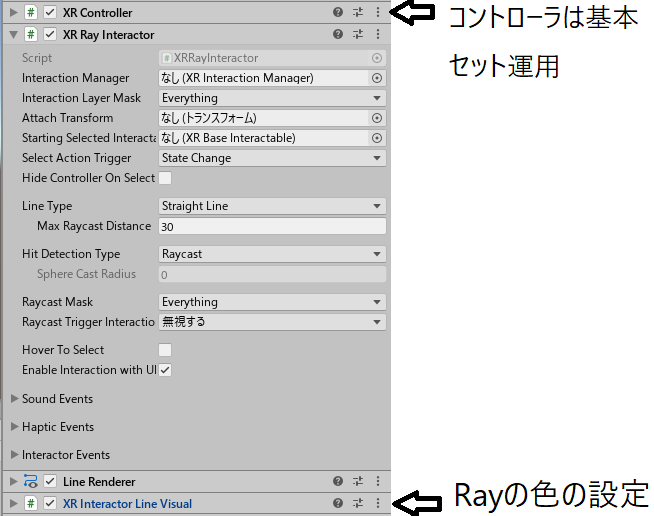
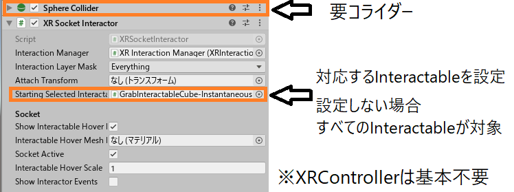

# XR Interaction Toolkit
## ~~を使ってみた話~~
## ではまった話

@yusuke-ota

---

<!--
* AR <= サンプルがほとんど無いので、触ってみて、まとめる

-->

## 自己紹介

@yusuke-ota

**アマチュアプログラマー**  
C++(PlatformIO)、C#(Unity)、Rust、Ruby

**最近気になること**  
Unreal Engine、シェーダー、サーバー

---

## XR開発環境(Unity公式)

[画像引用]  
Unity XR  
プラットフォームの  
最新情報
<https://blogs.unity3d.com/jp/2020/01/24/unity-xr-platform-updates/>

---

### MARS

は分からないので、飛ばします  
(6/1から使えるらしい)

---

### AR Foundationとは

別機種間のAR関係の処理を**同じコード**で書ける  
(機種依存機能は除く)

**Ver3.x**  
AR Core、AR Kit対応

**Ver4.x(preview)**  
AR Core、AR Kit、**HoloLens、Magic Leap One**対応

---

### AR Foundation蛇足

AR FoundationでARアプリを作って  
実機上で起動できない(起動してすぐに落ちる)場合

ARCore XR PluginやARKit XR Pluginが  
**入っていない可能性が高い**

---

ARCoreXRPluginがない時の動作.gif

---

### XR Interaction Toolkitとは

入力周りのあれこれの実装を楽にしてくれる  

**VR**: UI操作、つかむ動作、スナップ、テレポート  
**AR**: UI操作、オブジェクト操作、オブジェクト生成

---

## XR Interaction Toolkit

### AR、VRでの機能対応表

|機能|AR|VR|
|:---:|:---:|:---:|
|オブジェクトインタラクション|〇|〇|
|UIインタラクション|〇|〇|
|オブジェクト配置|〇|×|
|ロコモーション|×|〇|

---

### 機能分類表

---

## オブジェクトインタラクション

**Interactor**

動作の主体(主にコントローラ)

**Interactable**

動作の客体(主にキューブなどのオブジェクト)

---

## XR(要コントローラー)

---

### Interactor

動作の主体(主にコントローラ)

---

#### XRRayInteractor

レイキャストを出す機能、物の指定とか

<video autoplay loop controls height="500"><source src="ImageForDocument/RayInteractor.mp4"></video>

---

---

#### XRDirectInteractor

直接オブジェクトを触って操作する機能

<video autoplay loop controls height="500"><source src="ImageForDocument/DirectInteractor.mp4"></video>

---

要コライダー

---

#### XRSocketInteractor

対応するオブジェクトを設定した位置に戻す機能

<video autoplay loop controls height="500"><source src="ImageForDocument/SocketInteractor.mp4"></video>

---

---

### Interactable

動作の客体(主にキューブなどのオブジェクト)

---

#### XRSimpleInteractable

カーソルの操作でイベントを発火させる機能

<video autoplay loop controls height="500"><source src="ImageForDocument/SimpleInteractable.mp4"></video>

---

---

#### XRGrabInteractable

XRSimpleInteractable + つかむ機能

<video autoplay loop controls height="500"><source src="ImageForDocument/GrabInteractable.mp4"></video>

---

Velocity: 速度を加えて移動させる(ばねっぽい挙動)  
Kinematic: 座標を書き換えて移動させる  
Instantaneous: Physicsがかからない(Dynamic updateっていつ?)

---

#### XRTintInteractableVisual

アクション時、色を変えて強調する機能

<video autoplay loop controls height="500"><source src="ImageForDocument/TintInteractableVisual.mp4"></video>

---

要[Emission](https://docs.unity3d.com/ja/2019.1/Manual/StandardShaderMaterialParameterEmission.html) 対応シェーダー、Interactable

---

### UIインタラクション

---

#### TrackedDeviceGraphicRaycaster

コントローラーがあればVR,AR両対応できるらしい

<video autoplay loop controls height="500"><source src="ImageForDocument/TrackedDeviceGraphicRaycaster.mp4"></video>

---

uGUIに重ねて使う  
XRRayInteractorで操作出来るようになる

---

## VR

---

### ロコモーション

XRRigを動かす機能群

---

#### SnapTurnProvider

水平キー入力でカメラを回転させる機能

<video autoplay loop controls height="500"><source src="ImageForDocument/SnapTurn.mp4"></video>

---

---

#### TeleportationProvider

後述のTeleportationAnchor, Areaを駆動する

<video autoplay loop controls height="500"><source src="ImageForDocument/TeleportationProvider.mp4"></video>

---

---

#### TeleportationAnchor

指定したTransformにテレポートする機能

<video autoplay loop controls height="500"><source src="ImageForDocument/TeleportationAnchor.mp4"></video>

---

---

#### TeleportationArea

エリア内のどこへでもテレポートできる機能

<video autoplay loop controls height="500"><source src="ImageForDocument/TeleportationArea.mp4"></video>

---

---

## AR

---

### Interactor

動作の主体

---

#### ARGestureInteractor

タップ等で、オブジェクトを操作する機能

---

AR CameraにMainCameraタグが必要

<!-- 
GetValidTargets()内でCamera.mainを使用する -> 
MainCameraタグが必要 -> 
しかしAR CameraにはデフォルトでMainCameraタグがついていない
-->

---

### Interactable

動作の客体

---

#### ARPlacementInteractable

平面に設定されているプレハブを生成する機能

---

---

#### ARSelectionInteractable

タップでオブジェクトを選択する機能

---

---

#### ARRotationInteractable

ツイストでオブジェクトを回転させる機能

---

要ARSelectionInteractable

---

#### ARScaleInteractable

ピンチでオブジェクトサイズを変更する機能

---

要ARSelectionInteractable

---

#### ARTranslationInteractable

ドラッグでオブジェクトを移動させる機能

---

要ARSelectionInteractable

---

#### ARAnnotationInteractable

所定の角度、範囲内にオブジェクトがある場合  
アノテーション用のオブジェクトを表示、非表示にできるらしい

上手く動かせなかった

---

## まとめ

* UnityはXR系の開発環境を一本化しようとしているっぽい  
* AR,MR周りはAR Foundationを使うと良い  
* (要コントローラー)人間からの入力を共通化できる  
* なんかXR Interaction Toolkitの機能の説明をした  

コントローラーぁ...

---

## 参考文献

Unity XR プラットフォームの最新情報  
<https://blogs.unity3d.com/jp/2020/01/24/unity-xr-platform-updates/>

About AR Foundation  
<https://docs.unity3d.com/Packages/com.unity.xr.arfoundation@4.0/manual/index.html>

---

## 参考文献(XR Interaction Toolkit)

XR Interaction ツールキットのプレビューパッケージ公開  
<https://blogs.unity3d.com/jp/2019/12/17/xr-interaction-toolkit-preview-package-is-here/>

XR Interaction Toolkit  
<https://docs.unity3d.com/Packages/com.unity.xr.interaction.toolkit@0.9/manual/index.html>

XR Interaction Examples  
<https://github.com/Unity-Technologies/XR-Interaction-Toolkit-Examples>

